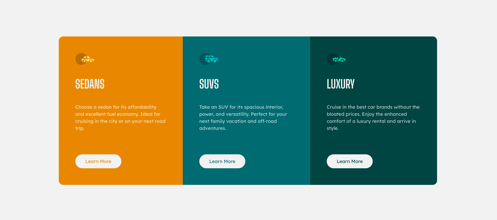

# Frontend Mentor - 3-column preview card component solution

This is a solution to the [3-column preview card component challenge on Frontend Mentor](https://www.frontendmentor.io/challenges/3column-preview-card-component-pH92eAR2-). Frontend Mentor challenges help you improve your coding skills by building realistic projects.

## Table of contents

- [Overview](#overview)
  - [The challenge](#the-challenge)
  - [Screenshot](#screenshot)
  - [Links](#links)
- [My process](#my-process)
  - [Built with](#built-with)
  - [What I learned](#what-i-learned)
  - [Continued development](#continued-development)
  - [Useful resources](#useful-resources)
- [Author](#author)

## Overview

### The challenge

Users should be able to:

- View the optimal layout depending on their device's screen size
- See hover states for interactive elements

### Screenshot



### Links

- Solution URL: [Add your solution URL here](https://github.com/nof1eld)
- Live Site URL: [Add your live site URL here](https://your-live-site-url.com)

## My process

### Built with

- Semantic HTML5 markup
- CSS custom properties
- Flexbox
- [React](https://reactjs.org/) - JS library
- Responsive design principles

### What I learned

During this project, I improved my skills in creating responsive layouts using React and CSS Flexbox. I particularly focused on implementing proper component structure, hover states, and ensuring the design works well across different screen sizes.

Some code highlights:

```jsx
function Column(num, icon, title, text) {
  return (
    <div className="column" id={`column-${num}`}>
      
      <h2>{title}</h2>
      <p>{text}</p>
      <button>Learn More</button>
    </div>
  );
}
```

```css
.container {
  display: flex;
  flex-direction: row;
}

@media (min-width: 768px) {
  .card-container {
    flex-direction: column;
  }
}
```

### Continued development

In future projects, I want to focus more on:

- Improving my React component architecture
- Implementing more advanced state management
- Exploring styled-components or other CSS-in-JS solutions
- Optimizing for accessibility

### Useful resources

- [React Documentation](https://reactjs.org/docs/getting-started.html) - The official React docs helped me structure my components properly.
- [CSS-Tricks Flexbox Guide](https://css-tricks.com/snippets/css/a-guide-to-flexbox/) - This comprehensive guide helped me understand Flexbox layouts better.
- [MDN Web Docs](https://developer.mozilla.org/en-US/) - An excellent reference for HTML and CSS properties.

## Author

- Github - [Nof1eld](https://www.github.com/nof1eld)
- Frontend Mentor - [@nof1eld](https://www.frontendmentor.io/profile/nof1eld)
